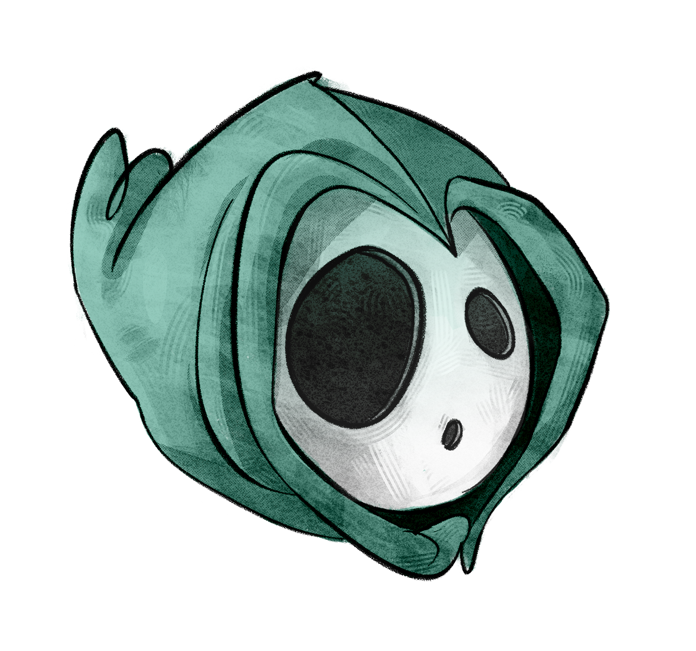
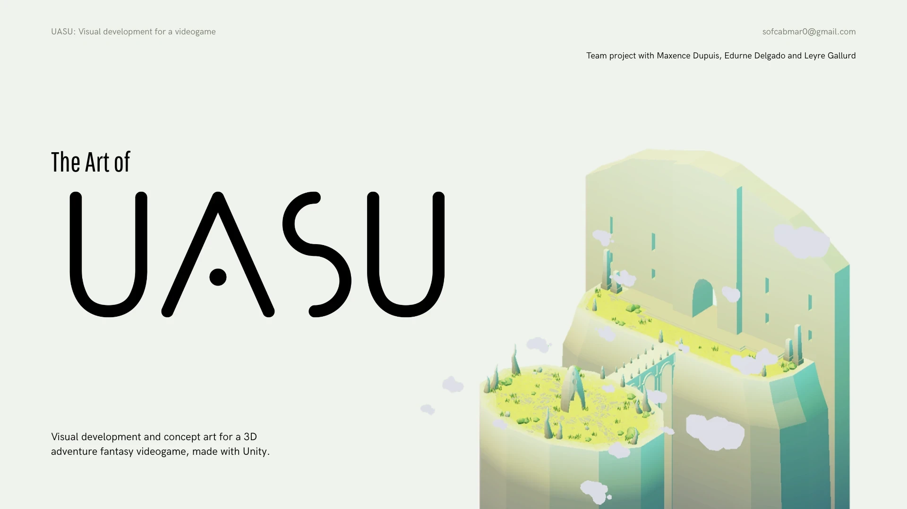

# Uasu

**Uasu** is a **French-Spanish** collaboration dedicated to creating a **video game**, combining tools such as Notion, Blender, Photoshop, and Unity.

  

## Game Demo

* Checkout the [Game Demo](https://www.youtube.com/watch?v=vaYAowGwGuM) on YouTube.

## The Art of Uasu

* Checkout concept artist artstation to discover all about [The Art of Uasu](https://www.artstation.com/artwork/bgyRGr).

## Game Design Document

Every details about the game are inside a GDD (Game Design Document).

* Checkout the [Game Design Document](./docs/uasu_gdd.pdf).
